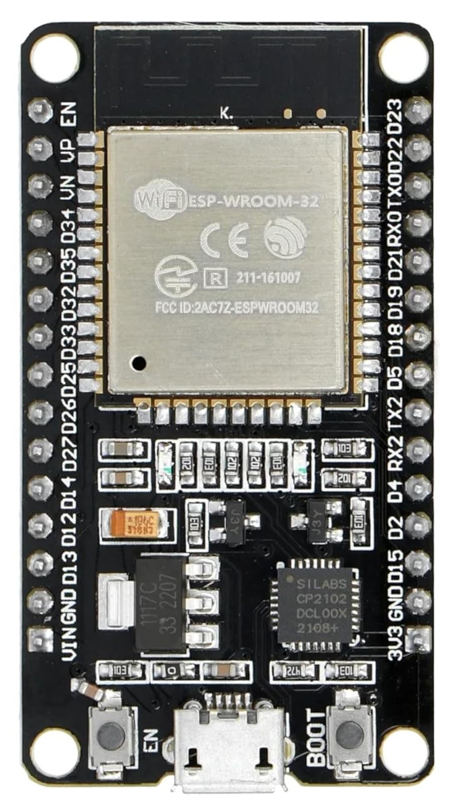

# Intro

This book is an informal collection of what I explore, tinker with, and learn along the way. The content isn't meant to be professional; Just raw documentation of my journey.

## Prerequisites
If you haven't already read the ["The Rust on ESP Book"](https://docs.esp-rs.org/book/introduction.html), I highly recommend doing so first. While this book will cover some aspects of setting up the development environment and basic concepts, it will not go into as much detail to avoid unnecessary repetition, as these topics are already thoroughly explained in the official book.

## Meet the Hardware
We will be using the "ESP32 DevKit V1" development board, which comes with built-in Wi-Fi and Bluetooth capabilities, along with an integrated RF module

## Datasheets
For detailed technical information, specifications, and guidelines, refer to the official datasheets:
* [ESP32 Datasheet](https://www.espressif.com/sites/default/files/documentation/esp32_datasheet_en.pdf)

## Support this project

You can support this book by starring this project on [GitHub](https://github.com/ImplFerris/esp-book) or sharing this book with others 😊

### Disclaimer: 
The experiments and projects shared in this book have worked for me, but results may vary. I'm not responsible for any issues or damage that may occur while you're experimenting. Please proceed with caution and take necessary safety precautions.

